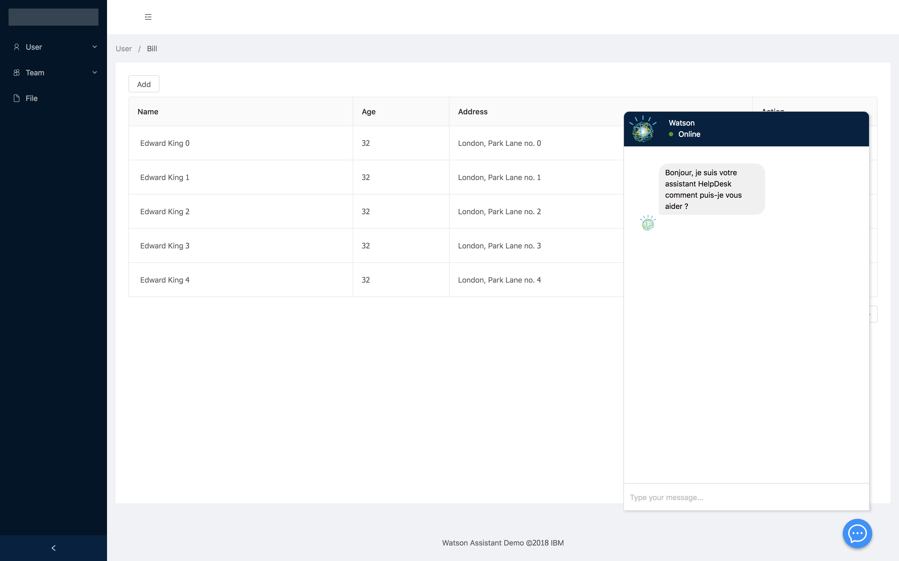

# Watson Assistant Demo

An Node.js/Angular project to use Waston Assistant and other IBM Cloud services

## Configure the environment

* In the server folder : 
    * Rename the `.env.example` into `.env` (nothing before the dot)
    * Fill it with your credentials from the Watson & IBM Cloud services

* In the client folder :
    * Go to *src/environments*
    * In the *environment.ts* file, change the url to the one where your server will run in dev
    * In the *environment.prod.ts* file, change the url to the one where your server will run in prod if needed
 

## Run in development

* Run the Server :
    * Install the dependencies : 
    ```
    cd server & npm install
    ```
    * Start the server :
    ```
    npm start
    ```

* Run the client :
    * Install the dependencies :
    ```
    cd client & npm install
    ```
    * Start the client :
    ```
    ng serve
    ```

## Run in production

* Build the client : 
    ```
    cd client & ng build --prod --env=prod --build-optimizer
    ```

* Place the *dist/* folder in the *server/* folder

## UI




The UI uses [**ng-zorro**](https://ng.ant.design/docs/introduce/en) : Ant Design for Angular